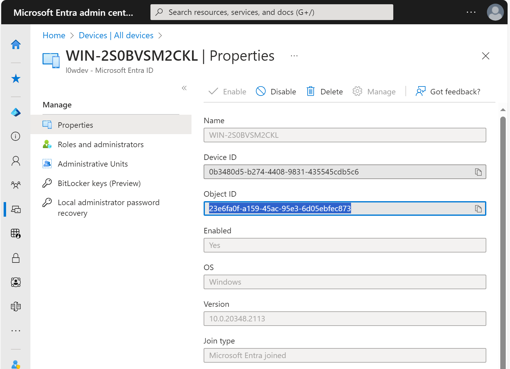
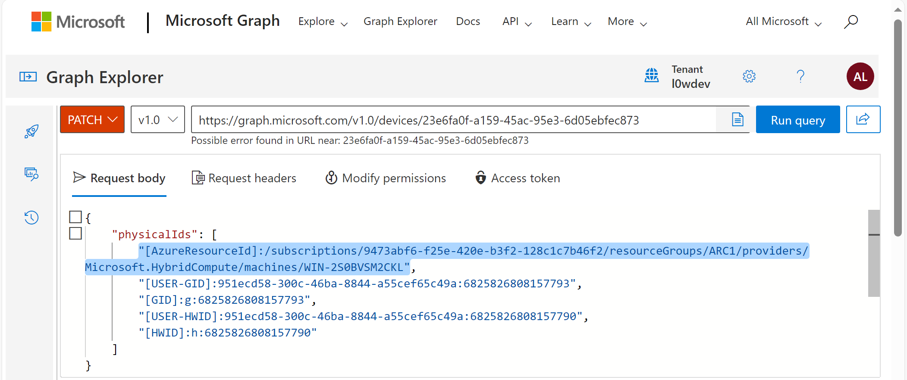

# himdsproxy

## Introduction

himdsproxy is a simple proxy for the Hybrid Instance Metadata Service (HIMDS) on [Azure Arc-enabled servers](https://learn.microsoft.com/en-us/azure/azure-arc/servers/overview).

himdsproxy translates requests for the IMDS endpoint `http://169.254.169.254` (served by [the Azure VM infrastructure](https://learn.microsoft.com/en-us/azure/virtual-machines/instance-metadata-service)) to requests for the HIMDS endpoint `http://localhost:40342` (served by [the Azure Connected Machine agent](https://learn.microsoft.com/en-us/azure/azure-arc/servers/agent-overview)).

himdsproxy allows you to obtain various instance metadata and OAuth2 access tokens ([managed identities for Azure resources](https://learn.microsoft.com/en-us/entra/identity/managed-identities-azure-resources/overview)) on on-premises servers, as if they were from the non-Hybrid IMDS, which is only available for Azure VMs.

One of the main use cases of himdsproxy is to enable [the non-Hybrid Entra Join](https://learn.microsoft.com/en-us/entra/identity/devices/concept-directory-join) on non-Azure VM Windows Servers using [RunAADLoginForWindows.ps1](RunAADLoginForWindows.ps1).  It utilizes the handler of [the AADLoginForWindows Azure VM extension](https://learn.microsoft.com/en-us/entra/identity/devices/howto-vm-sign-in-azure-ad-windows), which is not originally compatible with Azure Arc-enabled Windows Servers.  This helps you to eliminate the AD DS requirements by using cloud-native user authentication with the non-Hybrid Entra Joined Windows Servers.

## Known issues

- himdsproxy may not function as expected on Azure Arc-enabled servers hosted on AWS EC2.  This is due to a conflict between the Azure IMDS and [the AWS EC2 IMDS](https://docs.aws.amazon.com/AWSEC2/latest/UserGuide/ec2-instance-metadata.html), both of which use the same endpoint `http://169.254.169.254`. 
- The AADLoginForWindows extension handler with himdsproxy on Azure Arc-enabled servers registers devinces in Microsoft Entra ID with incorrect resource IDs.  The handler is not aware of hybrid devices so it uses the incorrect resource provider/type `Microsoft.Compute/virtualMachines` instead of the correct `Microsoft.HybridCompute/machines` in `physicalIds` of [Microsoft Graph device resources](https://learn.microsoft.com/en-us/graph/api/resources/device).  This affects [the RBAC related to virtual machine logins](https://learn.microsoft.com/en-us/entra/identity/devices/howto-vm-sign-in-azure-ad-windows#configure-role-assignments-for-the-vm).  After device registrations, you can correct them manually with the Microsoft Graph API: [Update device](https://learn.microsoft.com/en-us/graph/api/device-update).

## How to enable ME-ID based logins on Azure Arc-enabled Windows Servers

1. Deploy a Windows Server instance and register it as an Azure Arc-enabled server.
2. Download [the latest release of himdsproxy](https://github.com/yaegashi/himdsproxy/releases) and extract it into a folder.
3. Open the PowerShell admin console and execute the following commands:
    ```powershell
    PS> cd \path\to\himdsproxy
    PS> Unblock-File himdsproxy.exe
    PS> Unblock-File RunAADLoginForWindows.ps1
    PS> .\RunAADLoginForWindows.ps1
    ```
    Upon successful execution of the script RunAADLoginForWindows.ps1, you will see a line like the following:
    ```text
    2023-12-10T11:44:09.7168419Z    [Information]:  Handler Status: [{"status":{"code":0,"formattedMessage":{"lang":"en-US","message":"Successfully joined machine to AAD."},"name":"Microsoft.Azure.ActiveDirectory.AADLoginForWindows","operation":"AADJoin","status":"success","substatus":null},"timestampUTC":"\/Date(1702208649716)\/","version":"1"}]
    ```
   Note: The script RunAADLoginForWindows.ps1 is idempotent, which means you can run it multiple times until it completes successfully.  It also creates a `Logs` folder and saves the output in it.
4. Visit [the Microsoft Entra admin center](https://entra.microsoft.com), find the registered device and its Object ID.

5. Go to [the Microsoft Graph Explorer](https://developer.microsoft.com/en-us/graph/graph-explorer), get the device resource using the Object ID, and correct `physicalIds` using the `PATCH` operation.
   It initially looks like:
    ```json
    "physicalIds": [
        "[AzureResourceId]:/subscriptions/9473abf6-f25e-420e-b3f2-128c1c7b46f2/resourceGroups/ARC1/providers/Microsoft.Compute/virtualMachines/WIN-2S0BVSM2CKL",
        "[USER-GID]:951ecd58-300c-46ba-8844-a55cef65c49a:6825826808157793",
        "[GID]:g:6825826808157793",
        "[USER-HWID]:951ecd58-300c-46ba-8844-a55cef65c49a:6825826808157790",
        "[HWID]:h:6825826808157790"
    ],
    ```
    `[AzureResourceId]` should be corrected as follows:
    ```json
    "physicalIds": [
        "[AzureResourceId]:/subscriptions/9473abf6-f25e-420e-b3f2-128c1c7b46f2/resourceGroups/ARC1/providers/Microsoft.HybridCompute/machines/WIN-2S0BVSM2CKL",
        "[USER-GID]:951ecd58-300c-46ba-8844-a55cef65c49a:6825826808157793",
        "[GID]:g:6825826808157793",
        "[USER-HWID]:951ecd58-300c-46ba-8844-a55cef65c49a:6825826808157790",
        "[HWID]:h:6825826808157790"
    ],
    ```
    
6. Open the Azure Portal and assign the `Virtual Machine Administrator Login` or `Virtual Machine User Login` role to the hybrid virtual machine resource.  This allows users to sign in with their ME-ID.  See [Configure role assignments for the VM](https://learn.microsoft.com/en-us/entra/identity/devices/howto-vm-sign-in-azure-ad-windows#configure-role-assignments-for-the-vm).
7. Launch the remote desktop client `mstsc.exe` and connect to the device. See [Log in by using Microsoft Entra credentials to a Windows VM](https://learn.microsoft.com/en-us/entra/identity/devices/howto-vm-sign-in-azure-ad-windows#log-in-by-using-microsoft-entra-credentials-to-a-windows-vm).